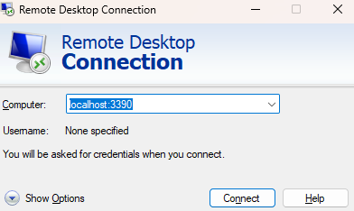
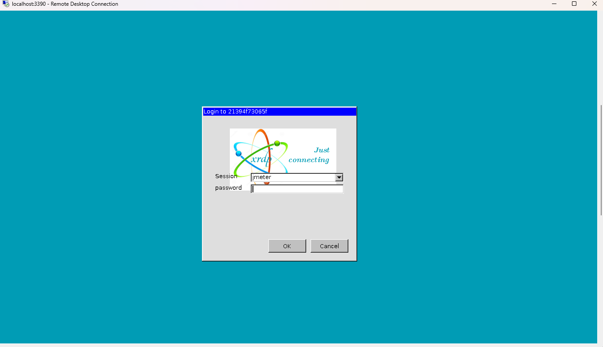
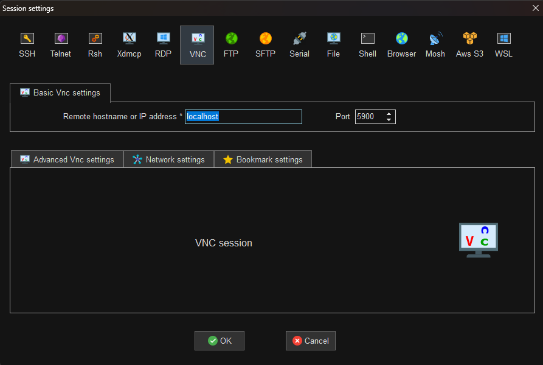
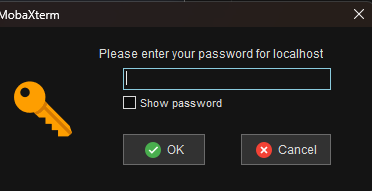
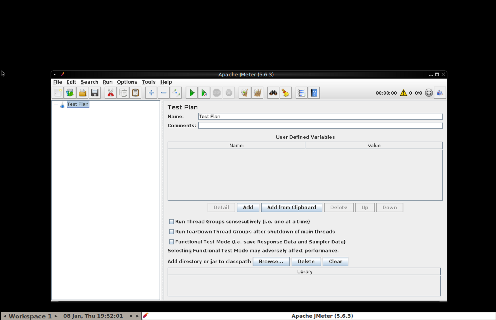
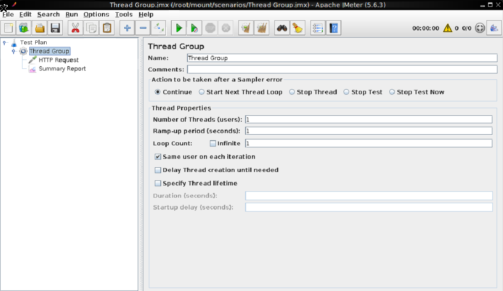
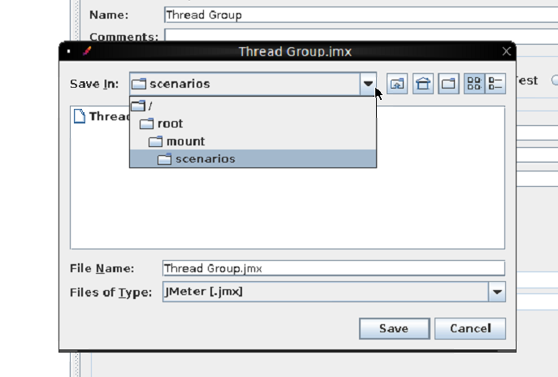

[](https://github.com/guitarrapc/docker-jmeter-gui/actions/workflows/build.yaml)
[](https://github.com/guitarrapc/docker-jmeter-gui/actions/workflows/release.yaml)
[](https://hub.docker.com/r/guitarrapc/jmeter-gui/)

# docker-jmeter-gui

Run [Apache JMeter](http://jmeter.apache.org) GUI in a Docker container and connect via RDP or VNC.

Find Images on [Docker Hub](https://hub.docker.com/r/guitarrapc/jmeter-gui).

## Motivation

Apache JMeter is a GUI-based performance testing tool, but setting up the runtime environment can be challenging.

- **Java dependency**: Requires specific JDK versions and environment configuration
- **Platform differences**: Behavior may vary across operating systems
- **Installation overhead**: You may not want to install JMeter directly on your host machine

This Docker image solves these problems by running JMeter GUI inside a container.

- Access JMeter GUI via **RDP** (default on Windows) or **VNC** (default on macOS/Linux)
- Mount host directories to create and save `.jmx` scenario files
- Keep your host environment clean without installing Java or JMeter
- Ensure consistent behavior across different platforms

## Usage

### Using Docker Run

```shell
docker run -itd --rm \
  -v ${WORK_DIR}/:/root/jmeter/ \
  -p 5900:5900 \
  -p 3390:3389 \
  guitarrapc/jmeter-gui:latest
```

- Replace `${WORK_DIR}` with your local directory path (e.g., `./scenarios`)
- Port `5900`: VNC
- Port `3390`: RDP (mapped from container's 3389)

### Using Docker Compose

See the [samples](./samples) directory for a complete example:

```shell
cd samples
docker compose up
```

### Connecting to JMeter GUI

**Password**: `root`

#### RDP (Recommended for Windows)

Use Windows Remote Desktop Connection or any RDP client.

- Host: `localhost:3390`
- Password: `root`





#### VNC (Recommended for macOS/Linux)

Use macOS Screen Sharing, VNC Viewer, or any VNC client.

- Host: `localhost:5900`
- Password: `root`






### Working with JMeter

JMeter GUI is automatically launched when the container starts:



Configure your JMeter test scenarios using the GUI:



Save your scenario files (`.jmx`) to the mounted volume (`/root/jmeter` in the container) to access them from your host:



## Build

To build the Docker image locally:

```shell
docker build -t jmeter-gui:5.6.3-ubuntu24.04 -f ./src/ubuntu24.04/Dockerfile .
```

Run your locally built image:

```shell
docker run -itd --rm -v ${PWD}/scenarios:/root/jmeter/ -p 5900:5900 -p 3390:3389 jmeter-gui:5.6.3-ubuntu24.04
```

## Version Information

- **Base Image**: Ubuntu 24.04
- **JMeter**: 5.6.3
- **JMeter Plugins Manager**: 1.10

## License

This project is licensed under MIT License.
