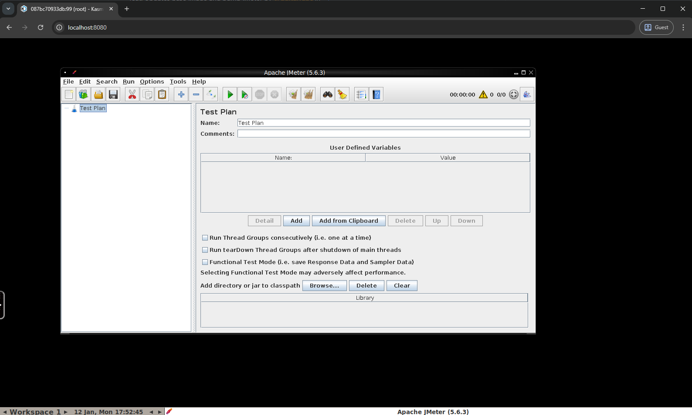
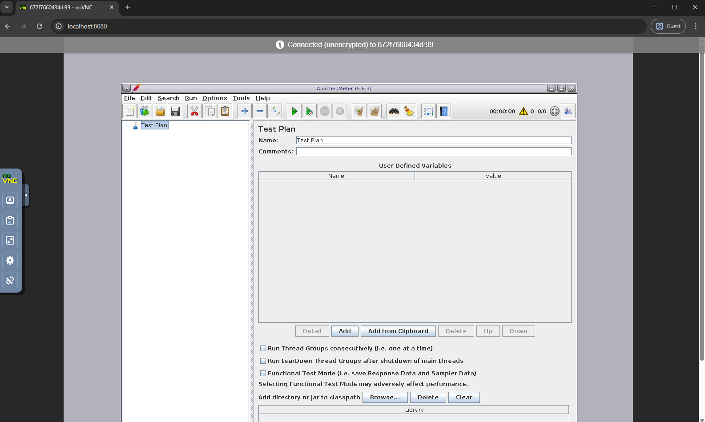

[](https://github.com/guitarrapc/docker-jmeter-gui/actions/workflows/build.yaml)
[](https://github.com/guitarrapc/docker-jmeter-gui/actions/workflows/release.yaml)
[](https://hub.docker.com/r/guitarrapc/jmeter-gui/)

# docker-jmeter-gui

Run [Apache JMeter](http://jmeter.apache.org) GUI in a Docker container and connect via browser.

Find Images on [Docker Hub](https://hub.docker.com/r/guitarrapc/jmeter-gui).

## Featured Tags

- [latest](https://github.com/guitarrapc/docker-jmeter-gui/blob/5.6.3/src/ubuntu24.04/Dockerfile), [5](https://github.com/guitarrapc/docker-jmeter-gui/blob/5.6.3/src/ubuntu24.04/Dockerfile), [5.6](https://github.com/guitarrapc/docker-jmeter-gui/blob/5.6.3/src/ubuntu24.04/Dockerfile), [5.6.3](https://github.com/guitarrapc/docker-jmeter-gui/blob/5.6.3/src/ubuntu24.04/Dockerfile) (Ubuntu 24.04 based)
  - `docker pull guitarrapc/jmeter-gui:5.6.3`
- [5-alpine3.23](https://github.com/guitarrapc/docker-jmeter-gui/blob/5.6.3/src/alpine3.23/Dockerfile), [5.6-alpine3.23](https://github.com/guitarrapc/docker-jmeter-gui/blob/5.6.3/src/alpine3.23/Dockerfile), [5.6.3-alpine3.23](https://github.com/guitarrapc/docker-jmeter-gui/blob/5.6.3/src/alpine3.23/Dockerfile) (Alpine 3.23 based)
  - `docker pull guitarrapc/jmeter-gui:5.6.3-alpine3.23`
- [5.3](https://github.com/guitarrapc/docker-jmeter-gui/blob/5.3/Dockerfile) (Alpine based - legacy, require VNC or RDP client)
  - `docker pull guitarrapc/jmeter-gui:5.3`

## Motivation

Apache JMeter is a GUI-based performance testing tool, but setting up the runtime environment can be challenging.

- **Java dependency**: Requires specific JDK versions and environment configuration
- **Platform differences**: Behavior may vary across operating systems
- **Installation overhead**: You may not want to install JMeter directly on your host machine

This Docker image solves these problems by providing JMeter GUI in a containerized environment with browser-based access.

- **Browser-based operation**: Access JMeter GUI directly from your web browser using KasmVNC - no VNC/RDP client installation required
- **Zero client setup**: Operate JMeter GUI from any OS with just a web browser
- **Cross-platform support**: Available on both Ubuntu 24.04 and Alpine 3.23 base images
- **Easy file sharing**: Mount host directories to create and save `.jmx` scenario files
- **Clean environment**: Keep your host system clean without installing Java or JMeter
- **Consistent behavior**: Ensure identical operation across different platforms

## Usage

### Using Docker Run

Run the container with your scenario directory mounted:

```shell
docker run -itd --rm -v ${WORK_DIR}/:/root/jmeter/ -p 8080:8080 guitarrapc/jmeter-gui:latest
```

- Port `8080`: Browser-based access
- Available variants:
  - `guitarrapc/jmeter-gui:5.6` (Ubuntu 24.04 based)
  - `guitarrapc/jmeter-gui:5.6.3-alpine3.23` (Alpine 3.23 based)

### Using Docker Compose

See the [samples](./samples) directory for a complete example.

```shell
cd samples
docker compose up
```

### Connecting to JMeter GUI

This image uses **KasmVNC**(Ubuntu) or **noVNC** (Alpine) for browser-based access.

1. Start the container using Docker run or Docker Compose
2. Open your web browser
3. Navigate to: `http://localhost:8080`
4. JMeter GUI will be accessible directly in your browser

This approach works on any operating system (Windows, macOS, Linux) without additional software.

| Ubuntu 24.04 Variant | Alpine 3.23 Variant |
| --- | --- |
|  | 

### Working with JMeter

JMeter GUI is automatically launched when the container starts.


Configure your JMeter test scenarios using the GUI.


Save your scenario files (`.jmx`) to the mounted volume (`/root/jmeter` in the container) to access them from your host.


## Build

To build the Docker image locally.

```shell
docker buildx build --platform linux/amd64,linux/arm64 -t jmeter-gui:5.6.3-ubuntu24.04 -f ./src/ubuntu24.04/Dockerfile src/ubuntu24.04/
docker buildx build --platform linux/amd64,linux/arm64 -t jmeter-gui:5.6.3-alpine3.23 -f ./src/alpine3.23/Dockerfile src/alpine3.23/
```

Run your locally built image.

```shell
docker run -it --rm -v ${PWD}/scenarios:/root/jmeter/ -p 8080:8080 jmeter-gui:5.6.3-ubuntu24.04
docker run -it --rm -v ${PWD}/scenarios:/root/jmeter/ -p 8080:8080 jmeter-gui:5.6.3-alpine3.23
```

## Version Information

- **Base Image**: Ubuntu 24.04, Alpine 3.23
- **JMeter**: 5.6.3
- **JMeter Plugins Manager**: 1.10

## License

This project is licensed under MIT License.
